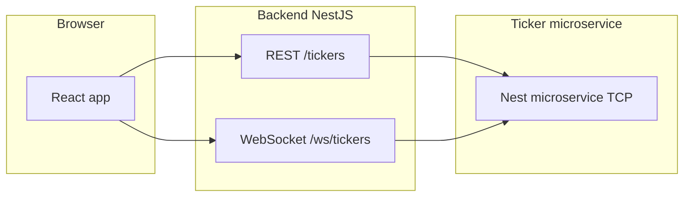

# Crypto dashboard

A small full-stack app for browsing cryptocurrency tickers: a dashboard lists assets with search and pagination, and each asset has a detail view with price history charts. Data flows from a dedicated ticker microservice through a NestJS API (REST + WebSocket) to a React frontend.

## Architecture



| Service | Role | Default port |
| -------- | ---- | ------------ |
| **frontend** | Client-side app  | `5173` |
| **backend** | HTTP API for tickers and history; WebSocket stream for live updates | `4444` |
| **ticker-service** | Microservice that serves ticker data and price history | `4445` |

The backend calls the ticker service over TCP (`TICKER_SERVICE_HOST` / `TICKER_SERVICE_PORT`). The browser talks to the backend over HTTP and `ws://localhost:4444/ws/tickers` when using the default Docker Compose setup.

### REST API (backend)

- `GET /tickers` — list tickers (`limit`, `offset`, optional `search`)
- `GET /tickers/:symbol` — single ticker
- `GET /tickers/:symbol/history` — price history for charts

## Tech stack

- **Monorepo**: pnpm workspaces
- **Backend**: NestJS 11, WebSockets (`@nestjs/platform-ws`), microservices (`@nestjs/microservices`)
- **Frontend**: React 19, React Router 7, Vite 8, Tailwind CSS 4, Radix / shadcn-style UI, Runtypes for validation, Recharts
- **Shared types**: `libs/common` (`@shared/common`)

## Prerequisites

- Node.js 20+ (frontend package expects `>=20.19.0`)
- [pnpm](https://pnpm.io/)
- Docker and Docker Compose (recommended for running all services)

## Project setup

```bash
pnpm install
```

## Run with Docker

Starts ticker-service, backend, and frontend with the correct networking and env vars.

```bash
docker compose up --build
```

- App UI: http://localhost:5173  
- Backend API: http://localhost:4444  

Stop and remove containers:

```bash
docker compose down
```

## Run locally (without Docker)

Requires a running ticker microservice and backend; set `TICKER_API_URL` and `VITE_TICKER_WS_URL` for the frontend to point at backend.

From the repo root, you can run all three processes:

```bash
pnpm run dev:all
```

Or run them separately: `pnpm run start:dev:ticker`, `pnpm run start:dev`, `pnpm run dev:frontend`.

## Build

```bash
pnpm run build          # Nest: backend + ticker-service
pnpm run build:frontend # production frontend build
```

## Tests

```bash
pnpm run test # unit tests (Jest)
pnpm run test:cov # coverage
```

## Repository layout

- `apps/frontend` — UI
- `apps/backend` — HTTP + WebSocket gateway to the ticker service
- `apps/ticker-service` — microservice with ticker domain logic
- `libs/common` — shared TypeScript types and utilities
